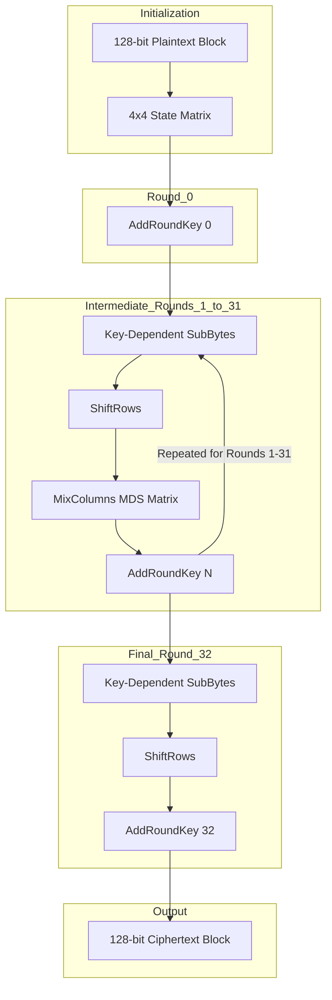

# SPN Block Cipher Round Logic (32 Rounds)

```mermaid
graph TD
    subgraph Initialization
        Input[128-bit Plaintext Block] --> Matrix[4x4 State Matrix]
    end

    subgraph Round_0
        Matrix --> ARK0[AddRoundKey 0]
    end

    subgraph Intermediate_Rounds_1_to_31
        ARK0 --> SB[Key-Dependent SubBytes]
        SB --> SR[ShiftRows]
        SR --> MC[MixColumns MDS Matrix]
        MC --> ARK[AddRoundKey N]
    end

    subgraph Final_Round_32
        ARK --> SB32[Key-Dependent SubBytes]
        SB32 --> SR32[ShiftRows]
        SR32 --> ARK32[AddRoundKey 32]
    end

    subgraph Output
        ARK32 --> Out[128-bit Ciphertext Block]
    end

    %% Loop for Rounds 1-31
    ARK -- "Repeated for Rounds 1-31" --> SB
```
