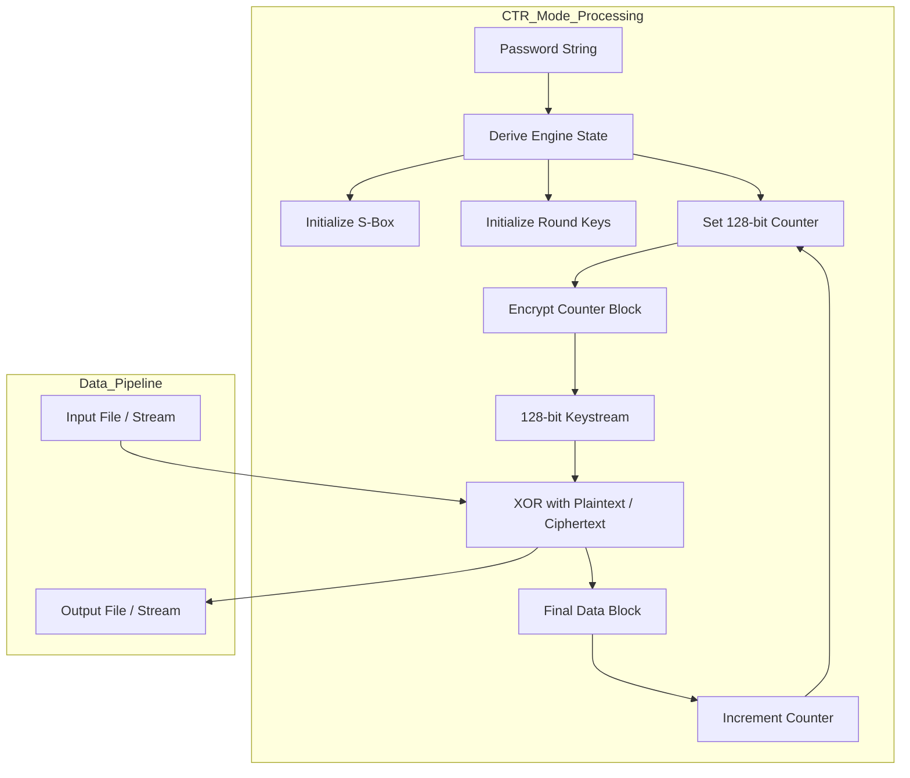

# Overall Encryption / Decryption Flow (CTR Mode)

```mermaid
graph TD
    subgraph CTR_Mode_Processing
        PW[Password String] --> Derive[Derive Engine State]
        Derive --> SBox[Initialize S-Box]
        Derive --> Keys[Initialize Round Keys]
        Derive --> Counter[Set 128-bit Counter]
        
        Counter --> EncBlock[Encrypt Counter Block]
        EncBlock --> KeyStream[128-bit Keystream]
        KeyStream --> XOR[XOR with Plaintext / Ciphertext]
        XOR --> Result[Final Data Block]
        
        Result --> Next[Increment Counter]
        Next --> Counter
    end

    subgraph Data_Pipeline
        PIn[Input File / Stream] --> XOR
        XOR --> COut[Output File / Stream]
    end
```
