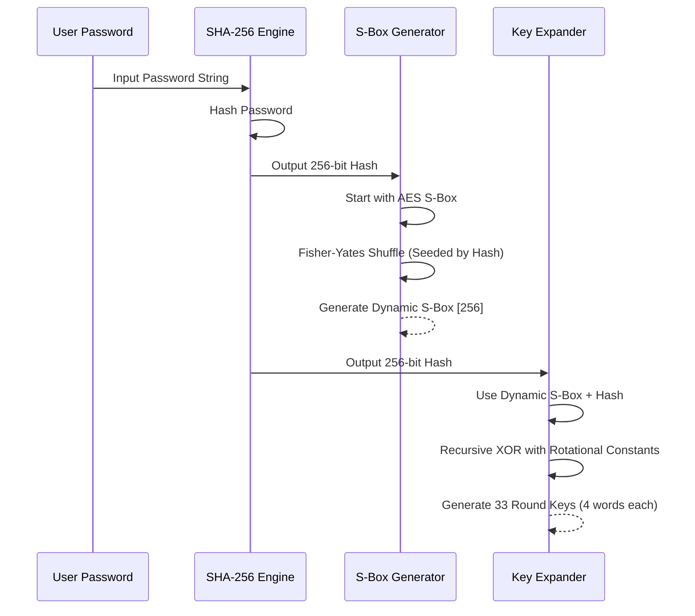

# Key Initialization and Derivation (SHA-256 / Fisher-Yates)

```mermaid
sequenceDiagram
    participant User as User Password
    participant SHA as SHA-256 Engine
    participant SBox as S-Box Generator
    participant KeyExp as Key Expander

    User->>SHA: Input Password String
    SHA->>SHA: Hash Password
    SHA->>SBox: Output 256-bit Hash
    SBox->>SBox: Start with AES S-Box
    SBox->>SBox: Fisher-Yates Shuffle (Seeded by Hash)
    SBox-->>SBox: Generate Dynamic S-Box [256]
    
    SHA->>KeyExp: Output 256-bit Hash
    KeyExp->>KeyExp: Use Dynamic S-Box + Hash
    KeyExp->>KeyExp: Recursive XOR with Rotational Constants
    KeyExp-->>KeyExp: Generate 33 Round Keys (4 words each)
```
